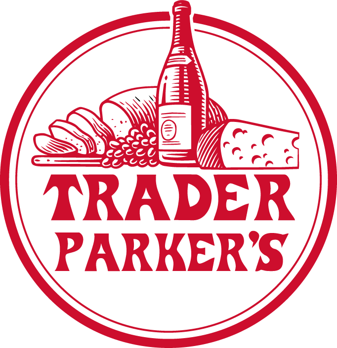

# Design Decisions — Trader Parker's Bag Bazaar

This is a writeup of the decisions behind [Trader Parker's Bag Bazaar](../README.md): what the constraints were, what forks I hit, what I chose, and what each choice cost. It is deliberately framed around decisions rather than features, because the interesting part of a project is rarely *what* it does, it's *why* it is shaped the way it is.

It is also honest about the parts that were lucky, the parts that were a quick fix, and the parts I would do differently. A case study that only lists wins isn't a case study.

---

## Context and constraints

The project is a birthday gift for my friend Parker, who collects Trader Joe's reusable bags. I wanted to build her something she could look at and be proud of.

I gave myself no hard deadline. What I did set was a small target: within a week, reach an MVP where Parker could upload photos of her bags. Past that point, I gave myself the freedom to add any feature I wanted, whenever I wanted. The framing matters: I treated this as *freedom*, not a constraint list. With no deadline, I wanted to see what I could actually make if I just kept going.

The constraints I *did* hold were these:

- **Free to host and run.** This was never even a question. The project had to cost nothing to keep alive.
- **GitHub Pages, specifically.** I wanted the practice, so I picked GitHub Pages and stayed stubborn about it, even later when it actively fought me (see [Architecture](#architecture-a-static-site-that-can-still-be-written-to)).
- **Mobile-first.** Parker takes and uploads her photos from her phone, so the admin upload flow had to work from a phone camera and photo library, and every page had to read cleanly on a small screen. Designing for the phone first also meant the laptop case (file and photo uploads) came along for free.
- **Solo build, on purpose.** I wanted to relearn how to build a site from scratch, so I built the whole thing alone.

That self-imposed "GitHub Pages, and free" boundary is the single most important fact about this project. I didn't stumble into it. I chose it and refused to drop it, and that is what forced most of the interesting decisions below.

---

## Framing the problem: two halves, not one

The first version of the site got the framing wrong.

I started by treating the catalog of all Trader Joe's bags as Parker's **progress tracker**: here are all the state bags, here's how many of the 38 states she's collected, a scoreboard. The catalog existed to measure her collection.

Two realizations flipped that.

**The catalog had standalone value.** While researching, I found that there is no central documentation of every Trader Joe's bag anywhere: not on Reddit, not anywhere online. This site would be the first. The moment I understood that, the catalog stopped being a sidekick to Parker's journal. It deserved to be its own thing, a real reference. Calling it a progress bar undersold it.

**The progress-tracker framing hurt the gift.** If the catalog were Parker's scoreboard, then all 85 bags would mostly read as bags she *doesn't* have yet. A gift would have turned into a long checklist of things missing. That is the opposite of what a gift should feel like.

So I split the site into two halves that stay deliberately separate:

- **The Encyclopedia** — every Trader Joe's bag design that exists. A reference, for anyone. It never frames itself around what Parker owns.
- **Parker's Collection** — the bags she actually has, with her own photos, the store, the date, the memory. A celebration, for her. Ownership appears on the catalog side only as a quiet aside, never as a percentage.

To protect the gift further, Parker controls what her own journal shows. She can toggle which categories (state, special, standard) display, so the collection stays a celebration of what *she* chooses to celebrate, on her terms.

**The decision worth noting:** the two halves serve two different audiences, and that pulled in one real direction. The encyclopedia is built to be *found* by strangers, with SEO and prerendered pages. Pouring "stranger-facing" effort into a personal gift could feel like a contradiction, but it isn't: the encyclopedia is the half that genuinely benefits from being discoverable, and making it discoverable takes nothing away from the present. The separation is also clean enough that the encyclopedia could be lifted out into its own product someday. That it's even *possible* to imagine that cleanly is the sign the split is a real architectural seam, not just a visual choice.

---

## Architecture: a static site that can still be written to

Here is where the self-imposed constraint earned its keep.

GitHub Pages serves static files only. It cannot accept writes. But Parker needs to add bags, and the public needs to suggest entries, and both of those are writes. The honest option on the table was to move to a host that supports a backend. I didn't want to. I wanted the GitHub Pages practice, and I was stubborn about keeping it.

So the question became: how does a static site accept a write?

**The decision.** The data lives as flat JSON files committed into the repo itself: `encyclopedia.json`, `pantry.json`, `stores.json`. There is no database. When Parker submits the admin form, a small **Cloudflare Worker** authenticates her and commits the new bag and its photos straight into the repo via the GitHub API. That commit triggers the existing GitHub Actions deploy workflow, the site rebuilds, and the bag goes live. The Worker is a thin, authenticated write proxy and nothing more. The commit, not the Worker, is what wakes the deploy up.

**The tradeoffs I accepted:**

- Writes are *slow*. A write is a commit plus a full CI rebuild, so a new bag takes a minute or two to appear. This is completely fine for roughly five bags a month, and would be unacceptable for anything interactive.
- There is no concurrency story and no querying. Again, fine at this scale, a dealbreaker at a larger one.

**A side effect, named honestly.** Because every write goes through a git commit, every bag, edit, and suggestion is permanently recorded with full history and can be reverted in one click. That is a genuinely nice property, but I want to be clear: it was a *side effect* of using the repo this way, not something I engineered for. Calling it deliberate design would be overclaiming it.

**The fallback.** If the Worker isn't deployed at all, the site still works completely. The admin form simply falls back to showing the JSON to copy and paste in by hand. The catalog never depends on the backend existing. The backend only flips the site into "Parker can save bags from her phone" mode.

### Deep links and discoverability

A single-page app has a known weakness: every URL serves the same empty HTML shell and lets JavaScript fill it in. That is bad for deep links and invisible to search engines.

This mattered only for the encyclopedia, the discoverable half, and SEO was always a secondary goal rather than the point of the project. So the fix was sized to match: a build-time prerender pass generates a real static HTML file for every encyclopedia route, each one carrying the right title, meta tags, and structured data. The deploy then copies `index.html` to `404.html` so GitHub Pages hands unknown routes back to the router.

The decision here is the *sizing*. This was a low-stakes problem, so it got a quick, cheap, build-time fix rather than deep deliberation. Knowing when a problem deserves a fast fix instead of a careful one is itself part of the judgment.

---

## Data modeling: variants versus separate entries

A modeling fork came up early: some bags share a shape but differ only in their print or color. Do those become one entry or several?

The rule I landed on:

> A genuinely different **design** — one with its own full set of distinct angle photos — gets its own entry and its own page. The same design in a different **color** stays a *variant* under one entry.

Two cases show the line:

- **The mini canvas tote** comes in Classic, Halloween, and Pastel. Front and back are the same design, only the color changes, and the colors ship as seasonal batches. So all three live as **variant chips under one entry**. Splitting them into three near-identical pages would just clutter the catalog.
- **Older-era state prints** — for example Arizona's standard bag and its earlier "Sonoran Voyage" print — are genuinely different *designs* of the same state. Those stay as **separate entries**, two distinct pages, linked to each other by a shared state code.

The reason for the asymmetry is the catalog's purpose. The encyclopedia exists to show how Trader Joe's bags have *changed over time*. A different print is a different chapter of that history and deserves its own page. A different color of the same print is not.

All 85 entries also mean the encyclopedia is, simply, a very long page — in both the gallery view and the dictionary view. To keep it navigable, both views carry an **alphabet scrubber** pinned to the right edge: a quick index a user can run down to jump straight to a letter or section instead of scrolling the whole way. It's the same idea as the alphabet rail in a phone's contacts list. The page is long *because* the catalog is complete, so the navigation has to make that length cheap to move through — a comprehensive reference is only useful if you can get around it fast.

---

## The photo pipeline: when to automate

This is where most of the actual labor went, and it produced the build-versus-buy decision I'm most happy with.

I did the first 43 state bags **entirely by hand** in one long night: find each resale listing, download the photos, knock out the background in Illustrator, crop, rotate, then label everything into folders. I did it by hand because I did not trust code to remove backgrounds and rotate and scale as well as I could myself.

Then I realized I was nowhere near done, and I did not want to spend more nights manually searching Poshmark and eBay. So I built a scraper.

The decisions inside that:

- **I didn't automate prematurely.** I waited until 43 bags of manual work had *proven* the cost was real. Only then did I build tooling, and by then I knew exactly which part hurt.
- **I automated the safe part first.** The scraper took over *searching and downloading* — the purely mechanical work, the part with no quality risk. I targeted Poshmark specifically because its sellers reliably post front, back, left, right, and bottom shots, which is the exact multi-angle structure the archive uses.
- **For the quality-sensitive part, I kept a human in the loop.** Background removal did eventually get automated too, but as a pattern, not a handoff: the script does the bulk work, then I screen every resulting image and manually pull aside and fix the ones that need it.

My original distrust held up. Automated background removal stumbles when a bag is close in color to its background. But the design absorbs that instead of pretending it won't happen: automate the heavy lifting, gate the output with human review, hand-fix the failures.

**In hindsight:** the scraper should have come first, before the long manual night, and I should have taken more of the automation opportunities I saw and skipped. I'd also define the complete list of bags up front next time, before building the thing that displays them. That said, building as you go is a legitimate part of development, and that is what I did.

---

## Visual identity: extending a brand, not inventing one

The look of the site is deliberate, and almost none of it was invented from scratch.

The direction came straight from Trader Joe's own website and materials. I recreated the Trader Joe's paper-bag logo in Illustrator, fork and spoon included, for the landing page. I reproduced their website elements as faithfully as I could. Their script typeface, used for the headings, is what ties the whole thing together. Every page background is set to mimic the texture of a kraft paper bag, so the site feels printed on the thing it is about.

  
  &nbsp;&nbsp;&nbsp;&nbsp;
  
  &nbsp;&nbsp;&nbsp;&nbsp;
  

<em>The marks I drew in Illustrator: the engraved emblem, the red-dot wordmark badge, and the TP monogram used as the favicon.</em>

The one element that was purely mine is the **framing**: each photo sits in a vintage engraved frame, presented like a gallery piece with a plaque for its caption. The "small museum for a grocery-store souvenir" concept is mine. But it still lives *inside* Trader Joe's visual vocabulary rather than fighting it. The icons follow the same rule: vintage and rococo styling, drawn either from designs already on the bags or from the kind of ornament Trader Joe's already uses.

The principle: designing coherently *within* an established design system, and extending it without breaking it, is harder and more valuable than a clean-slate look. A from-scratch aesthetic answers to nobody. Extending a real brand means every new element has to earn its place against an existing standard.

---

## Delight versus accessibility

The site is full of small flourishes: confetti on the birthday greeting, frames that swing on hover, a hidden playlist behind a logo, cats tucked into the page margins, bag and canvas puns in the captions.

It is also rigorously accessible. Every animation respects `prefers-reduced-motion` and softens or stops if the system asks for less motion. Hover effects switch off on touch screens so they never fire on a stray tap. Decorative art is hidden from screen readers while every real control keeps a plain-text label. Headings and landmarks are structured properly, and every interactive piece, including the hidden ones, works from the keyboard.

These two goals can pull against each other, and my rule is simple: **flourish always yields.** I design with the user in mind first. I would love every visitor to find every easter egg, but if a user wants less, the flourishes turn off. They are flourishes *for a reason* — the site is fully functional without a single one of them. They emphasize an already-finished site, they never carry it.

That is progressive enhancement stated plainly: a complete baseline experience for everyone, with an optional, additive layer of delight on top.

---

## Where it breaks at scale

A useful test of any design is knowing where it fails. If the encyclopedia took off and became its own product with real traffic, here is the honest assessment.

**Writes are bounded by reality.** The write path is the slow part — a commit plus a rebuild — but write *volume* is capped by something outside the software entirely: how fast Trader Joe's releases new bags. That is slow. The right instinct here is to scale to the load that actually exists, not an imagined one, and the real-world release cadence is the rate limiter. The repo would also eventually bump GitHub's size limits as photos accumulate, but slowly.

**Reads are not bounded that way.** Visitor count has nothing to do with Trader Joe's release schedule. And today every visitor's browser downloads the *entire* `encyclopedia.json` just to render a single bag's page. At 85 entries that file is tiny and it doesn't matter. At a few thousand entries it would be megabytes, and every visitor — even one who wants to see one bag — would pull all of it. The site would never go *down*, GitHub Pages keeps it available, but it would get *slow and wasteful*, and along two axes at once: more entries make the file bigger, more visitors each download the whole thing.

This is the distinction I'd flag in the writeup most: **availability and scalability are different axes.** "It stays up" does not mean "it stays fast."

The fix, when it's needed, is to stop shipping one big file: split the data into per-entry files (the per-route prerender already proves that shape works), or add an indexed, paginated API that serves only what a page needs. I know what the fix is. I am deliberately *not* doing it now, because at the current scale it would be solving a problem that doesn't exist yet.

---

## In closing

A one-line idea — "document Parker's growing bag collection" — quietly outgrew itself into a fully cataloged, version-controlled, accessible website that also happens to be the first complete encyclopedia of Trader Joe's tote bags.

The throughline of every decision here is the same: one self-imposed constraint, held stubbornly. Free to run, static host, GitHub Pages, built solo. Almost everything interesting in this project — the git-as-datastore write path, the prerender, the photo pipeline — exists because I refused to drop that constraint and had to design *around* it instead. Constraints, even the ones you pick for yourself, are where the real design happens.

---

  

